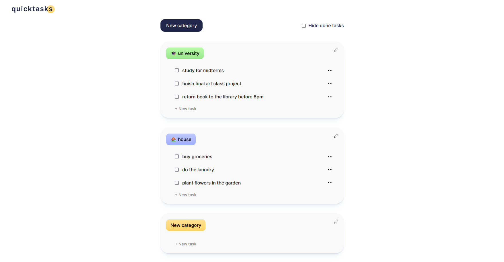

  

<em>quicktasks</em> is a to-do web list application that helps you manage your tasks efficiently, allowing you to organize them into categories. 

> **Note:** This project is still in development. Features and documentation are subject to change.

## Features
- Create and manage tasks
- Organize tasks into categories
- Specify different colors and names to categories
- Mark tasks as completed
- Hide completed tasks

## Stack
Fow now, this project is being built with HTML, CSS and vanilla JavaScript.

## Demo

  

## License
Licensed under the MIT License - see the LICENSE file for details.
